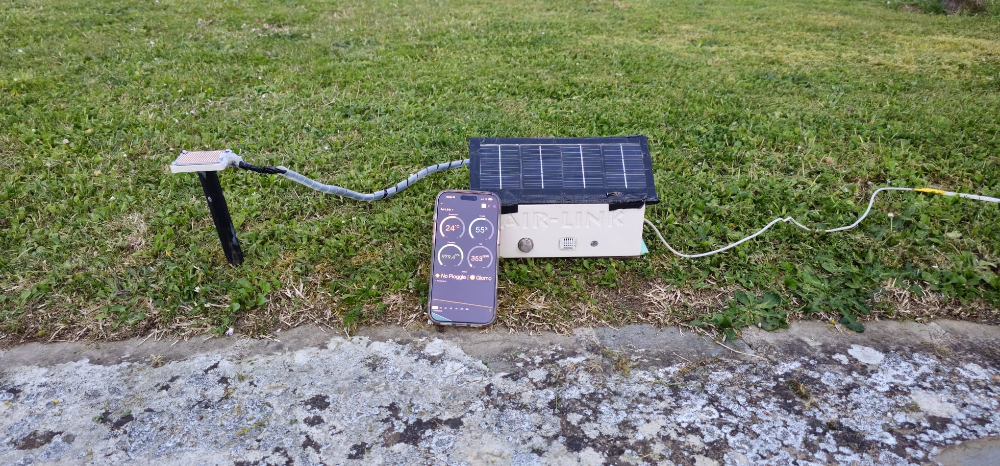
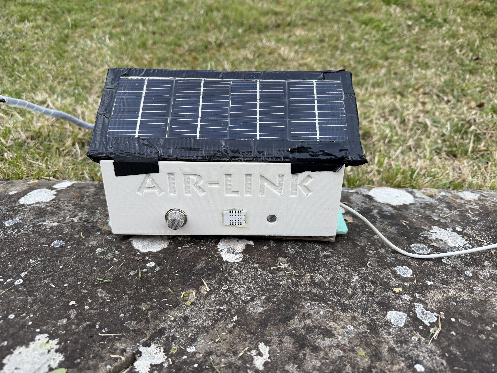
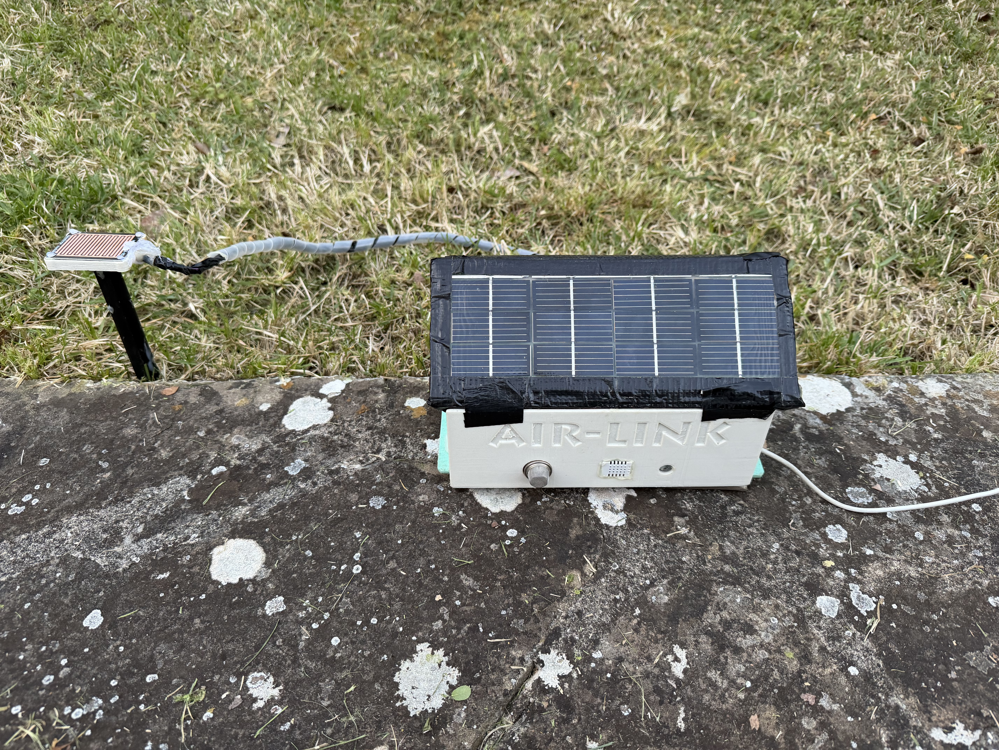
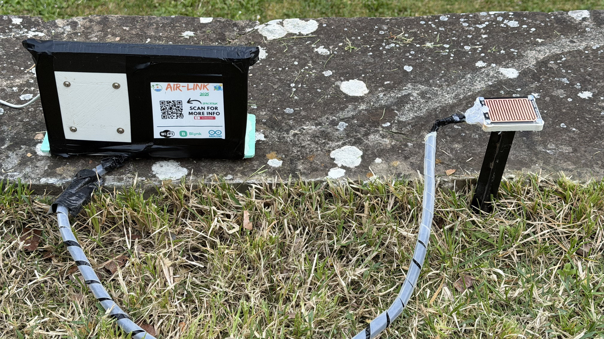
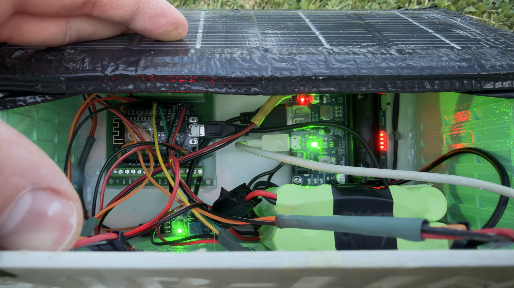
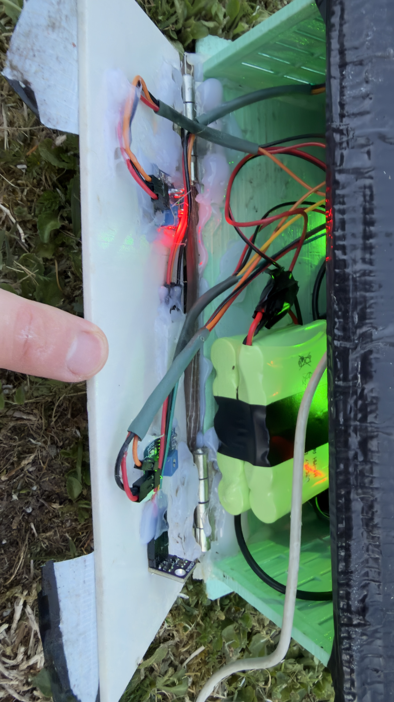
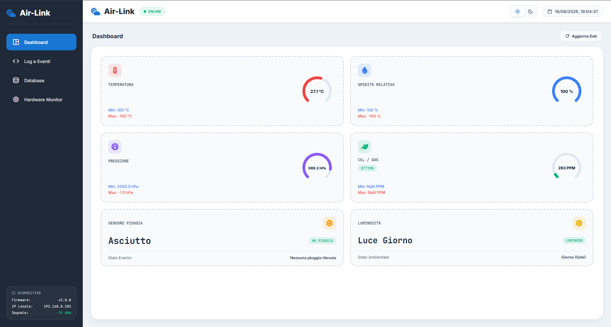
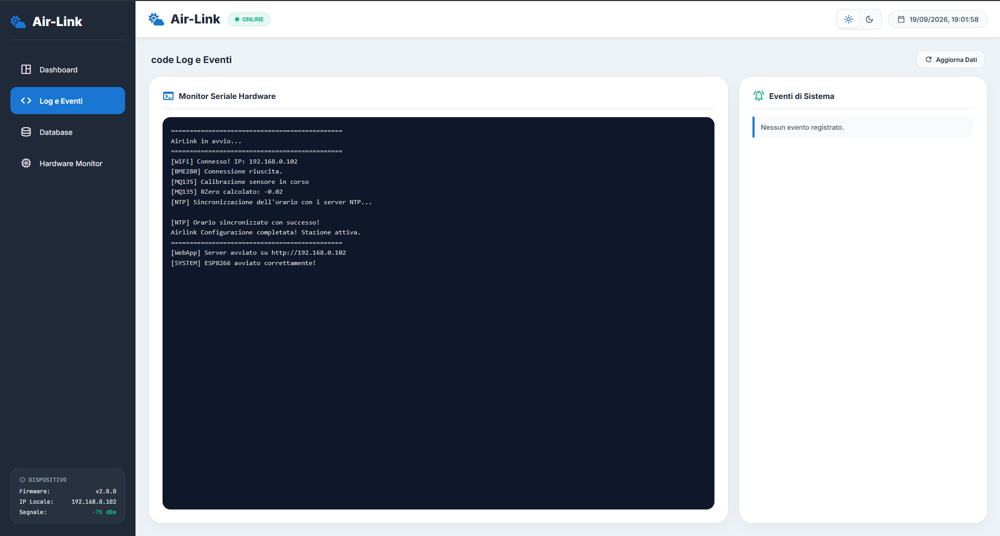
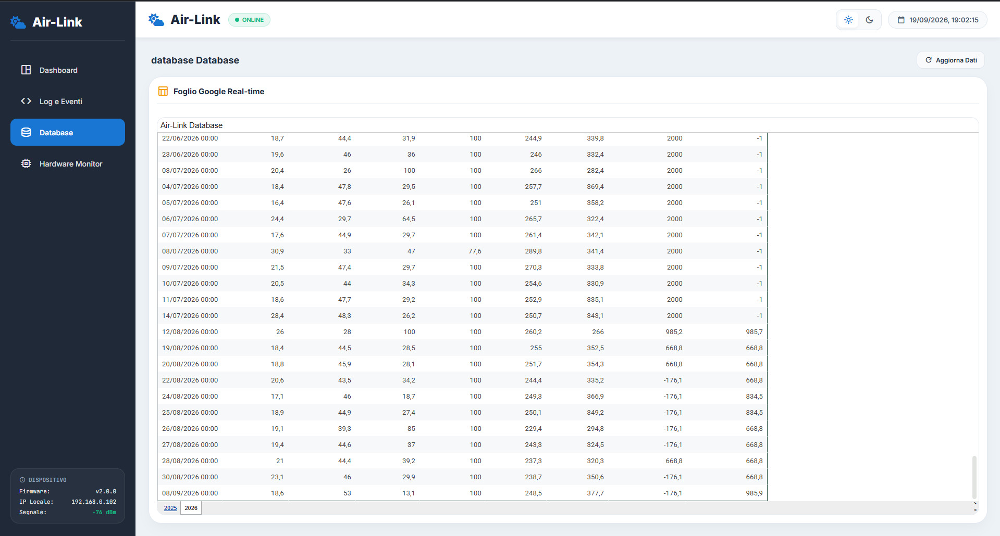
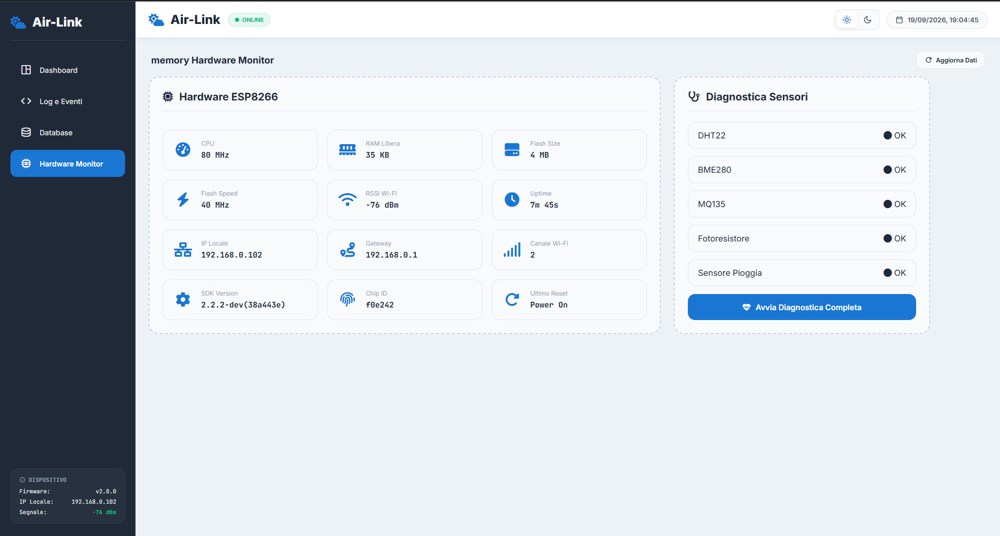

# ⛅ Air-Link Weather Station — ESP8266 IoT Station

Progettazione e sviluppo di una stazione meteorologica IoT basata su ESP8266, ideata per il monitoraggio continuo e in tempo reale dei parametri ambientali.

Il sistema integra un'alimentazione autonoma tramite pannello solare e batteria, un'interfaccia WebApp locale avanzata, integrazione Blynk Cloud e archiviazione automatica su Google Sheets via Google Apps Script per la gestione dello storico massimo e minimo dati, diagnostica hardware sensori automatica o manuale.

---

## ✨ Caratteristiche

- 🌡️ Monitoraggio ambientale completo (Temperatura, Umidità, Pressione, CO₂/Gas, Pioggia e Luminosità)
- ⚡ Alimentazione autonoma a energia solare con gestione batteria
- 🌐 WebApp locale avanzata responsive integrata nella memoria flash (supporto Dark Mode e PWA)
- 📱 Dashboard remota tramite Blynk IoT per il controllo su smartphone
- 📊 Archiviazione storica automatica su Google Sheets tramite Google Apps Script
- ⏱️ Monitor Seriale Hardware e Log Eventi direttamente nell'interfaccia Web
- 🔍 Diagnostica Sensori e stato scheda hardware in tempo reale
- 💾 Salvataggio configurazioni permanenti su memoria LittleFS

---

## 🛠️ Componenti

- Scheda ESP8266: https://link.amazon/B07Ca3mLb
- Sensore DHT22 (Temperatura e Umidità): https://link.amazon/B07UfuIQW
- Sensore BME280 (Pressione e Temperatura): https://link.amazon/B0822Gt12
- Sensore MQ-135 (Qualità dell'aria / CO₂): https://link.amazon/B02DOjJMK
- Sensore Pioggia:  https://link.amazon/B0eubRms5
- Fotoresistore LDR (Luminosità): https://link.amazon/B0aglTqg7
- Scheda Espansione Pin: https://link.amazon/B08PETw06
- Modulo di Ricarica: https://link.amazon/B00LH5GSM
- Pannello Solare: https://link.amazon/B08UpHSUW
- Batteria: https://link.amazon/B05Mq8msb
- Pla Bianco: https://link.amazon/B065QobIY
- Pla Verde: https://link.amazon/B08JhjWYT
- Jumper: https://link.amazon/B0eURkFrb
- NFC: https://link.amazon/B0h0Xi9Gp
- Fascette termorestringenti: https://link.amazon/B01QiYgsx

---

## 🖨️ Stampa 3D

La struttura è interamente progettata in 3D ed è studiata per un assemblaggio semplice e modulare.  
Il design pulito ed essenziale protegge i componenti elettronici interni dagli agenti atmosferici, garantendo al contempo un flusso d'aria ottimale per letture accurate dei sensori di temperatura, umidità e qualità dell'aria.

- 📐 **Design ottimizzato:** Struttura a casetta con griglia e inclinazione per proteggere i sensori dall'irraggiamento diretto.
- 🧩 **Assemblaggio** Colla a caldo o Silicone per proteggere al meglio l'hardware.
- ☀️ **Resistenza outdoor:** Progettata per essere stampata in materiali resistenti ai raggi UV e alle intemperie (es. PETG o TPU).

---

## ☀️Alimentazione Autonoma

La stazione è progettata per operare in ambienti remoti o outdoor. L'energia viene fornita da un pannello solare che carica la batteria integrata, garantendo continuità di servizio anche durante la notte o nelle giornate di scarsa insolazione. Si può connettere un unità esterna quando il sole è assente.

---

## 🌐 Web App

L’ESP8266 ospita una WebApp responsive integrata accessibile da qualsiasi browser digitando l'indirizzo IP della stazione.

L'interfaccia comprende:

- 📊 Dashboard: Indicatori visivi ad anello, stato del meteo e valori min/max.
- 💻 Log e Eventi: Monitor seriale dal vivo e registro degli eventi di sistema.
- 📈 Database: Integrazione in tempo reale del foglio Google Sheets interno.
- 🛠️ Hardware Monitor: Diagnostica sensori, RAM libera, velocità Flash e segnale Wi-Fi (RSSI)
  
Non serve alcuna app aggiuntiva: è persino installabile come PWA (Progressive Web App) direttamente sullo schermo del tuo telefono!

---

## 📊 Google Sheets & Apps Script

I dati acquisiti dai sensori vengono inviati ad intervalli regolari a un foglio Google Sheets dedicato utilizzando un Webhook e un script Google Apps Script. Questo consente di mantenere uno storico delle misurazioni minime e massime della giornata in modo gratuito, illimitato e sempre consultabile.

---

## 📁 Struttura del progetto:

AirLinkWeatherStation/
│
├── File_3D_Case/
├── File_3D_Case/(file .stl della struttura)
├── File_3D_Case/(file .stl del supporto)
│
├── Interfaccia_Web_Airlink/
├── Interfaccia_Web_Airlink/index.html
│
├── Progettazione_e_Documentazione/
├── Progettazione_e_Documentazione/SchemaElettrico.png
├── Progettazione_e_Documentazione/Progetto_Gui_Air-Link
├── Progettazione_e_Documentazione/1.png
├── Progettazione_e_Documentazione/(eventuali altre immagini)
│
├── src/
├── src/Air_link/
├── src/Air_link/Air_link.ino
├── src/Air-Link_ApScriptGoogle/
├── src/Air-Link_ApScriptGoogle/Code.js
│
├── LICENSE
└── README.md

---

## 🚀 Installazione

1. Scarica o clona il repository. 
2. Configura lo script Google Apps Script all'interno del tuo account Google ed estrai l'URL di distribuzione. 
3. Inserisci le tue credenziali Wi-Fi, la chiave Blynk e l'URL di Google Script all'interno del file firmware e nella WebApp.
4. Carica l'interfaccia HTML/JS nella memoria flash dell'ESP8266 usando il plugin LittleFS.
5. Compila e carica il codice sull'ESP8266.
6. Apri l'indirizzo IP assegnato alla stazione dal tuo browser o l'app BlynkIot per iniziare il monitoraggio!

---

## 🎥 Immagini e Video

- Linkedin Post:
  
---

## 📸 Foto

  
  

  
  

  
  

  
  

  
  

---

## 🔐 Licenza

Questo progetto è distribuito sotto licenza:

### **Creative Commons Attribution‑NonCommercial 4.0 International (CC BY‑NC 4.0)**  

Puoi:

- Condividere  
- Modificare  
- Creare progetti derivati  

Ma **non puoi usarlo per scopi commerciali**.

Testo completo della licenza:  
https://creativecommons.org/licenses/by-nc/4.0/

---

